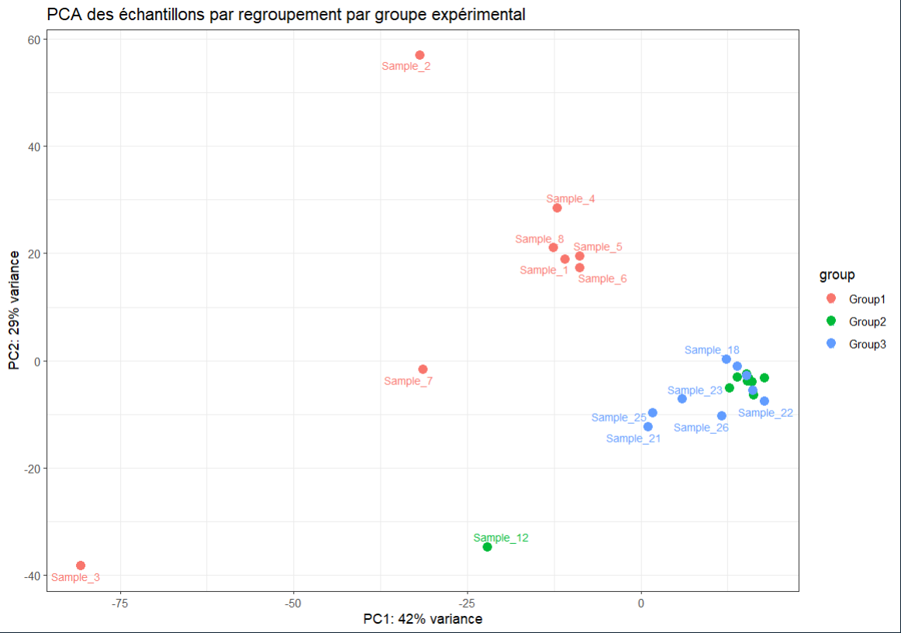
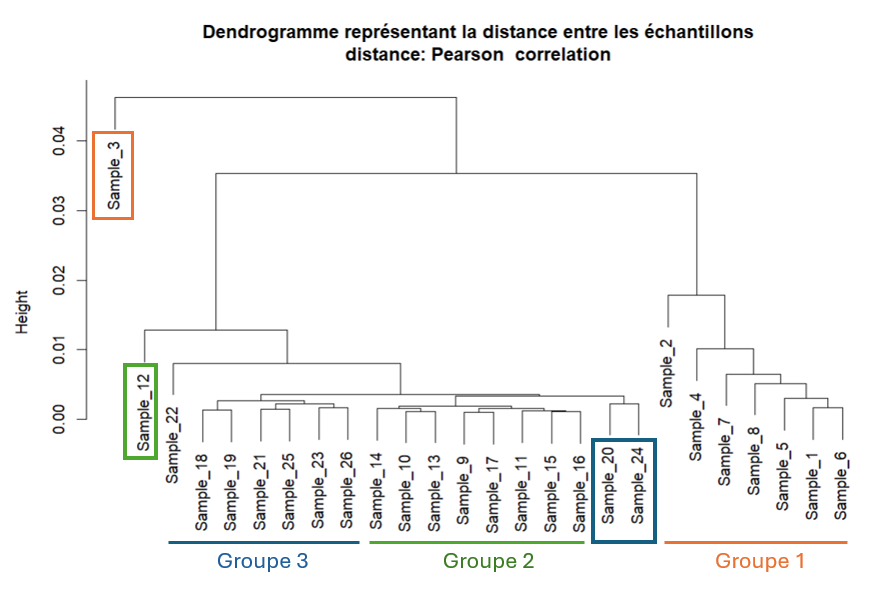
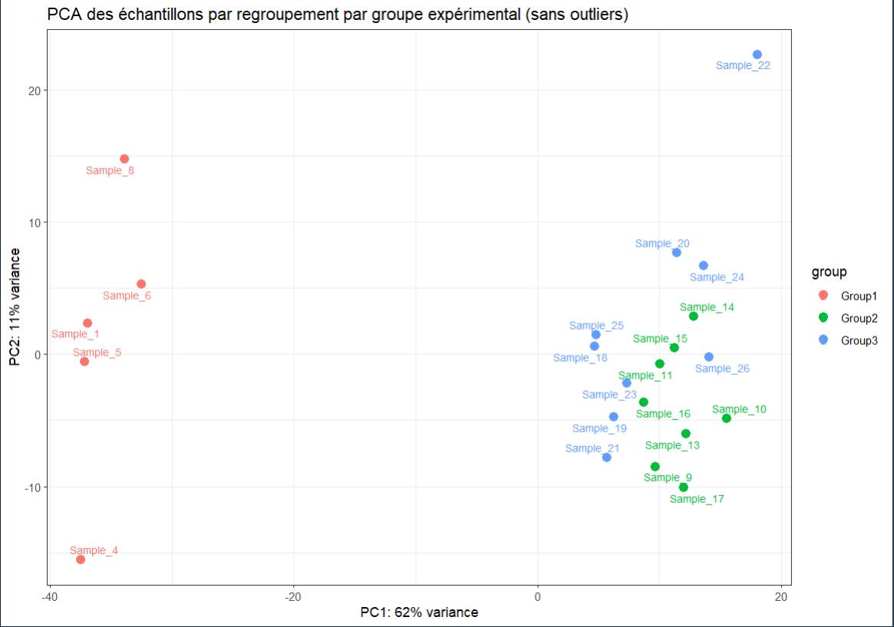
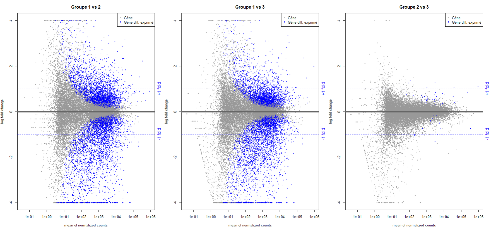

# Exercice_analyse_expression_differentielle

## Introduction
Ce dépôt contient le travail réalisé dans le cadre de l’exercice de sélection proposé par Simon Ducheix, chercheur au sein de l'unité de recherche de l'institut du thorax à Nantes et Yuna Blum chercheuse de l'Institut de Génétique & Développement de Rennes.
L’objectif de cet exercice est d’explorer un jeu de données de transcriptomique (comptages de gènes) réalisé sur 26 échantillons appartenant à trois groupes biologiques distincts :

- Groupe 1 : échantillons 1-8\
- Groupe 2 : échantillons 9-17\
- Groupe 3 : échantillons 18-26

## Objectif
L'objectif de l’analyse est double. Dans un premier temps, il faut déterminer la structure des données et évaluer si elles sont exploitable. Dans un second temps il faut réaliser une analyse d'expression différentielle afin d'identifier les tops gènes les plus différentiellement exprimés entre les conditions.

## Analyse

## Introduire schéma du pipeline d'analyse ##

### Import du jeu de données

La première étape consiste à importer le jeu de données contenant les comptages de lectures par gène et par échantillon.
```
file_path <- "data/gene_count.xls"

data_file <- read.table(file_path, header = T, sep = "\t")
```

Description :

Le fichier contient 33 808 lignes (correspondant à des gènes) et 35 colonnes (informations d’expression et d’annotation).

Voici la description détaillée des colonnes :

| Colonne | Description                                                                       |
| ------- | --------------------------------------------------------------------------------- |
| 1       | **gene_id** : Identifiant Ensembl du gène                                         |
| 2–27    | **Sample_1 à Sample_26** : Comptages bruts de lectures pour chaque échantillon    |
| 28      | **gene_name** : Nom du gène                                                       |
| 29      | **gene_chr** : Chromosome sur lequel se situe le gène                             |
| 30      | **gene_start** : Position de départ du gène                                       |
| 31      | **gene_end** : Position de fin du gène                                            |
| 32      | **gene_strand** : Brin du chromosome (sens ou antisens)                           |
| 33      | **gene_length** : Longueur du gène                                                |
| 34      | **gene_biotype** : Catégorie fonctionnelle (ex. protéique, non codant, etc.)      |
| 35      | **gene_description** : Brève description de la fonction du gène                   |
| 36      | **tf_family** : Famille de facteur de transcription à laquelle le gène appartient |

Le jeu de données complet est disponible dans le dossier data/.

### Création des fichiers d'analyse.

Pour réaliser une analyse d’expression différentielle, deux types de fichiers sont indispensables :

1.Un fichier de comptages — contenant les valeurs brutes de lecture (nombre de reads alignés par gène et par échantillon).

2.Un fichier de métadonnées (metadata) — décrivant les informations expérimentales associées à chaque échantillon (conditions biologiques, groupes expérimentaux, etc.).

Avec notre jeu de données, nous allons pouvoir créer en plus un fichier d’annotation des gènes contenant leurs descriptions fonctionnelles, ce qui facilitera l’interprétation biologique des résultats.

```
### -----------------------
### File formatage
### -----------------------

# Définir les noms de lignes du tableau de données
# Ici, chaque ligne correspond à un gène identifié par "gene_id"
rownames(data_file) <- data_file$gene_id  

# Supprimer la colonne gene_id maintenant qu'elle est en rownames
data_file <- data_file[,-1]  


### -----------------------
### Files creation
### -----------------------
# Création de la matrice de ReadCounts
# On sélectionne toutes les colonnes dont le nom commence par "Sample_"
ReadCount <- data_file[, grep("^Sample_", colnames(data_file))]


# Création de la table metadata
# Chaque échantillon est associé à un groupe biologique
# Group1 = Sample_1 à Sample_8, Group2 = Sample_9 à Sample_17, Group3 = Sample_18 à Sample_26
meta <- data.frame(
  sample = colnames(ReadCount),      # noms des échantillons
  group = c(
    rep("Group1", 8),                # 8 échantillons pour le Groupe 1
    rep("Group2", 9),                # 9 échantillons pour le Groupe 2
    rep("Group3", 9)                 # 9 échantillons pour le Groupe 3
  )
)


# Création du fichier de description des gènes
# On prend toutes les colonnes qui ne sont pas des échantillons.
genes_description <- data_file[, !grepl("^Sample_", colnames(data_file))]

```
Les nouveaux fichiers sont peuvent être retrouvés dans le dossier Data.

### Etapes de filtres des données.
#### Suppression des gènes non exprimés

Avant de procéder à l’analyse différentielle, il est essentiel de filtrer les données.
Cette étape vise à retirer les gènes faiblement exprimés ou non exprimés, qui n’apportent pas d’information biologique utile.
En supprimant ces gènes, on réduit le bruit dans les données et diminue la variance, ce qui améliore la puissance statistique des tests de DESeq2.

La première étape consiste à retirer les gènes qui ne sont exprimés dans aucun échantillon (valeur de comptage nulle pour toutes les librairies).
Ces gènes ne contribuent pas à la variabilité observée et peuvent être exclus sans perte d’information.

```
### -----------------------
### Data filtering
### -----------------------

# # Comptage des gènes non exprimés dans aucun échantillon
table(rowSums(ReadCount) == 0)

# Suppression de ces gènes
ReadCount <- ReadCount[rowSums(ReadCount) > 0, ]

# Vérification
table(rowSums(ReadCount) == 0)
```
Dans notre cas, aucun gène n’était totalement non exprimé, donc aucun n’a été supprimé à cette étape.

#### Filtrage basé sur le CPM (Counts Per Million)

Pour aller plus loin, nous appliquons un filtrage des gènes faiblement exprimés à l’aide de la méthode CPM (Counts Per Million).
Cette approche tient compte de la profondeur de séquençage de chaque librairie, ce qui permet une comparaison équitable des niveaux d’expression entre échantillons.

Le CPM se calcul en divisant le nombre de lectures mappant pour un gène d'une librairie par le nombre de lecture total de la librairie multiplié par 1 million.
J'ai choisi un seuil arbitraire de 10 CPM. Seuls les gènes suppérieur à ce seuil dans au moins 2 librairies sont conservés.

J'ai choisi de travailler avec la méthode des CPM car c'est une méthode souvent la méthode standard de filtration lors d'une analyse différentielle.

```
# Défiition du seuil à 10 cpm
cutoff <- cpm(10, mean(colSums(ReadCount)))

# On garde uniquement les gènes qui sont un score cpm au dessus de 10 au moins dans 2 librairies
keep <- rowSums(cpm(ReadCount)>cutoff[1]) >= 2

# Filtrer du fichier de comptage
ReadCount <- ReadCount[keep,]
```

À l’issue de ces étapes de filtrage, le jeu de données passe de 33 808 gènes à 22 050 gènes. Ainsi 11758 gènes ont été supprimés car ils présentaient des niveaux d’expression trop faibles pour être statistiquement exploitables.

### Création de l'objet DESeq et normalisations.

#### Création de la matrice de design

Une fois les données de comptage filtrées, nous pouvons créer l’objet DESeqDataSet, qui servira de base lors de l’analyse avec DESeq2.

Cet objet prend en compte :

- les comptages bruts filtrés (countData),

- les métadonnées expérimentales (colData),

- le modèle de design (design), qui décrit les groupes ou conditions expérimentales à comparer.

Chaque ligne correspond à un gène, et chaque colonne correspond à une librairie.

```
DESeq.ds <- DESeqDataSetFromMatrix(countData = ReadCount,
                                   colData = meta,
                                   design = ~ group)

```

#### Normalisation

Les données de comptage brutes ne sont pas directement comparables entre échantillons, car elles dépendent de la profondeur de séquençage (taille de la librairie) et du niveau global d’expression.

DESeq2 corrige ces biais en estimant des facteurs de normalisation (sizeFactors), qui mettent toutes les librairies et gènes sur une même échelle de comparaison.

```
DESeq.ds <- estimateSizeFactors(DESeq.ds)
DESeq.ds@colData$sizeFactor

```

Cette étape de normalisation permet d’obtenir des comptages ajustés entre échantillons, où les différences observées reflètent de véritables variations biologiques et non des biais techniques tels que la profondeur de séquençage ou les effets de batch.

Enfin, une transformation logarithmique régularisée (rlog, pour regularized log transformation) est appliquée.
Cette transformation a pour objectif de stabiliser la variance entre les gènes faiblement et fortement exprimés, tout en réduisant l’influence des valeurs extrêmes.
Contrairement à une simple transformation logarithmique, rlog() ajuste la transformation selon le niveau de comptage, ce qui la rend plus robuste pour les faibles valeurs.
```
rld <- rlog(DESeq.ds, blind = FALSE)
rlog.norm.counts <- assay(rld)

```
L’objet rld contient les valeurs normalisées et transformées, prêtes à être utilisées pour les analyses exploratoires telles que la PCA, les dendrogrammes ou les heatmaps.
Les données extraites via assay(rld) (rlog.norm.counts) représentent une version stabilisée et comparable des comptages d’origine.

### Analyses exploiratoires
#### ACP

L’analyse en composantes principales (ACP) est une méthode exploratoire permettant de résumer la variance présente dans les données et ainsi y visualiser la structure globale.

L’objectif de cette approche ex ploratoire est d’évaluer si les échantillons se regroupent par condition expérimentale (clustering cohérent par groupe), s’il existe des outliers (échantillons atypiques) et enfin si une séparation claire entre groupes est observable, suggérant une variabilité biologique.

La détection des outliers est primordiale car ils introduisent une variance non biologique, souvent liée à des effets techniques (effet de batch, qualité de séquençage, préparation d’échantillon, etc.).
Les identifier à ce stade est donc essentiel pour éviter qu’ils ne biaisent l’analyse différentielle.

Enfin, observer la structure globale des données est une étape importante. En effet, si les échantillons de groupes distincts ne se séparent pas sur les axes principaux, cela suggère une faible variance intergroupe, et donc un faible potentiel de détection de gènes différentiellement exprimés.

```
pcaData <- plotPCA(rld, intgroup = "group", returnData = TRUE)
percentVar <- round(100 * attr(pcaData, "percentVar"))
ggplot(pcaData, aes(PC1, PC2, color = group, label = name)) +
  geom_point(size=3) +
  geom_text_repel(size=3, max.overlaps=10) +
  xlab(paste0("PC1: ", percentVar[1], "% variance")) +
  ylab(paste0("PC2: ", percentVar[2], "% variance")) +
  theme_bw() +
  ggtitle("PCA des échantillons par regroupement par groupe expérimental")
```


En observant l’ACP, on remarque deux éléments importants.

Présence d’outliers :
Les échantillons 2, 3 et 7 du groupe 1, ainsi que l’échantillon 12 du groupe 2, apparaissent nettement éloignés de leurs réplicats respectifs.
Ces échantillons sont susceptibles d’introduire un bruit non biologique.

Structure globale des groupes :
Le groupe 1 se sépare nettement des groupes 2 et 3, indiquant une variance biologique importante entre ces conditions.
En revanche, les groupes 2 et 3 semblent fortement corrélés, suggérant des profils d’expression génique similaires.

Ces observations confirment la pertinence de la comparaison du groupe 1 contre les groupes 2 et 3, tandis que la comparaison entre groupes 2 et 3 pourrait révéler peu de gènes différentiellement exprimés.

### Dendrogramme 

L’analyse du dendrogramme permet d’obtenir une vision hiérarchique de la structure topologique du jeu de données.
Ce graphique illustre les similarités globales entre les échantillons en se basant sur leurs profils d’expression génique, et complète donc l’analyse réalisée par l’ACP.

Dans un premier temps, j’ai calculé une matrice de corrélation entre tous les échantillons à partir des comptages normalisés (rlog.norm.counts).
Chaque valeur de corrélation mesure la similarité des profils d’expression entre deux échantillons. Deux échantillons ayant un profil d’expression similaire présentent une corrélation élevée, tandis que des échantillons très différents auront une corrélation faible ou négative.

À partir de cette matrice de corrélation, on calcule ensuite une matrice de distance utilisée pour la classification hiérarchique.
La distance est définie ici comme 1 - corrélation, ce qui signifie que plus deux échantillons sont corrélés, plus leur distance est faible.


J’ai choisi la corrélation de Pearson car elle mesure la similarité de la forme globale des profils d’expression entre deux échantillons, indépendamment de leurs niveaux d’expression absolus.
Donc, elle évalue si les gènes varient dans la même direction (hausse ou baisse d’expression), même si l’intensité de cette variation diffère.




Le dendrogramme obtenu montre que les échantillons se regroupent majoritairement selon leur groupe expérimental, confirmant la cohérence globale des données.
On retrouve une séparation entre le groupe 1 et les groupes 2 et 3, ces deux derniers semblant encore être mélangé.

Cependant, plusieurs outliers apparaissent clairement. En effet, l’échantillon 3 est très éloigné des autres échantillons du groupe 1, l’échantillon 12 s’écarte également du groupe 2, tandis que les échantillons 2 et 7 du groupe 1 se situent en périphérie de leur cluster.

Pour la suite de l’analyse, j’ai donc pris la décision de retirer les échantillons 2, 3, 7 et 12.
Après cette filtration, le groupe 1 conserve 5 réplicats, ce qui reste suffisant pour représenter de manière fiable la variabilité intra-groupe.
```
distance.m_rlog  <- as.dist(1 - cor(rlog.norm.counts , method = "pearson" ))
plot(hclust(distance.m_rlog), labels = colnames(rlog.norm.counts),
     main = "Dendrogramme représentant la distance entre les échantillons\ndistance: Pearson  correlation")

```

### Suppression des outliers

```
# Définition des outliers :
outliers <- c("Sample_2", "Sample_3", "Sample_7", "Sample_12")

# Suppression des outliers du fichier de comptage
ReadCount_filtered <- ReadCount[, !(colnames(ReadCount) %in% outliers)]

# Suppression des outliers du fichier de métadonnées
meta_filtered <- meta[!(meta$sample %in% outliers), ]

# Création du nouveau objet DESeq
DESeq.ds <- DESeqDataSetFromMatrix (countData = ReadCount_filtered,
                                    colData = meta_filtered,
                                    design = ~ group)

# Normalisation du nouvel objet
DESeq.ds <- estimateSizeFactors(DESeq.ds)
DESeq.ds@colData$sizeFactor

# Transformation logarthmique
rld <- rlog(DESeq.ds, blind = FALSE)
rlog.norm.counts <- assay(rld)
```
On réalise une vérification graphique du nouveau jeu de données.




On remarque qu'on a bien enlevé les outliers, le jeu de données est plus structuré.

## Analyse d'expression diffférentielle avec DESeq2.

```
reference_group <- "Group1"
DESeq.ds$group <- factor(DESeq.ds$group, levels = c(reference_group, setdiff(levels(DESeq.ds$group), reference_group)))

DESeq.ds <- DESeq(DESeq.ds)
plotDispEsts(DESeq.ds)


group1 <- "Group1"
group2 <- "Group2"
group3 <- "Group3"
# here the method of adjustement of p-values is Benjamini and Hochberg (BH), also called FDR (false discovery rate)

# Group 1 vs Group 2
DGE.results_1v2 <- results(DESeq.ds, c("group", group1, group2), pAdjustMethod = "BH")
summary(DGE.results_1v2)
mcols(DGE.results_1v2, use.names = TRUE)

# Group 1 vs Group 3
DGE.results_1v3 <- results(DESeq.ds, c("group", group1, group3), pAdjustMethod = "BH")
summary(DGE.results_1v3)
mcols(DGE.results_1v3, use.names = TRUE)

# Group 2 vs Group 3
DGE.results_2v3 <- results(DESeq.ds, c("group", group2, group3), pAdjustMethod = "BH")
summary(DGE.results_2v3)
mcols(DGE.results_2v3, use.names = TRUE)

# results
results.DESeq2_1v2 <- DGE.results_1v2
results.DESeq2_1v3 <- DGE.results_1v3
results.DESeq2_2v3 <- DGE.results_2v3
```



## Résultats

## Conclusion
