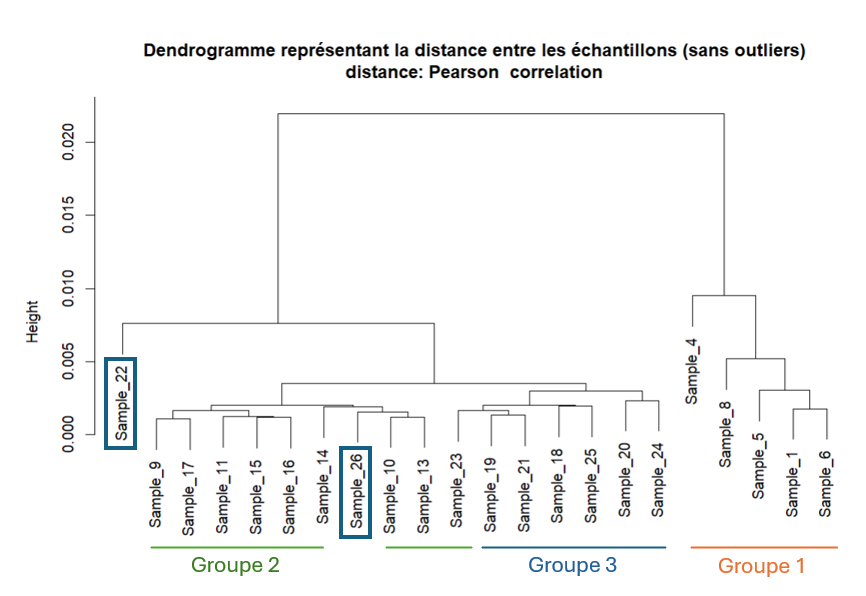
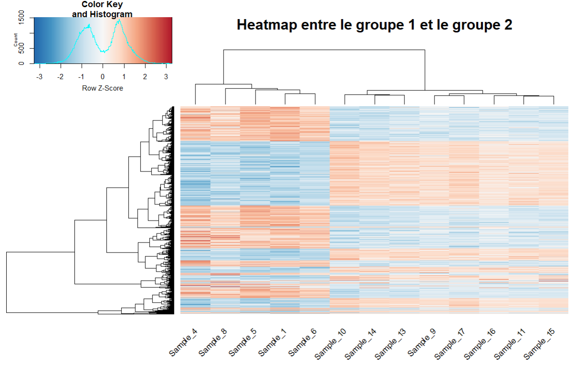
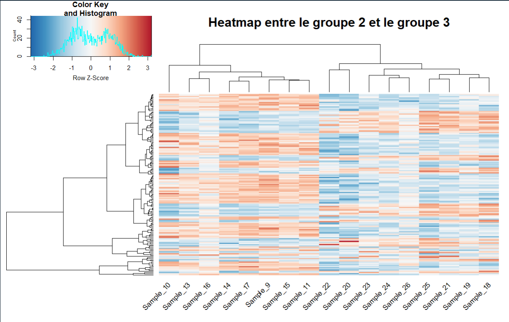

# Exercice_analyse_expression_differentielle

## Introduction
Ce dépôt contient le travail réalisé dans le cadre de l’exercice de sélection proposé par Simon Ducheix, chercheur au sein de l'unité de recherche de l'institut du thorax à Nantes et Yuna Blum chercheuse de l'Institut de Génétique & Développement de Rennes.
L’objectif de cet exercice est d’explorer un jeu de données de transcriptomique (comptages de gènes) réalisé sur 26 échantillons appartenant à trois groupes biologiques distincts :

- Groupe 1 : échantillons 1-8
- Groupe 2 : échantillons 9-17
- Groupe 3 : échantillons 18-26

## Objectif
L'objectif de l’analyse est double. Dans un premier temps, il faut déterminer la structure des données et évaluer si elles sont exploitable. Dans un second temps il faut réaliser une analyse d'expression différentielle afin d'identifier les tops gènes les plus différentiellement exprimés entre les conditions.

## Analyse

### Installation des packages

```
if (!requireNamespace("BiocManager", quietly = TRUE))
    install.packages("BiocManager")

# Packages CRAN
cran_packages <- c("ggplot2", "ggbeeswarm", "pheatmap", "ggrepel", "gplots", "RColorBrewer")
install.packages(setdiff(cran_packages, rownames(installed.packages())))

# Packages Bioconductor
bioc_packages <- c("edgeR", "DESeq2", "genefilter", "NMF")
BiocManager::install(setdiff(bioc_packages, rownames(installed.packages())))

```

### Import du jeu de données

La première étape consiste à importer le jeu de données contenant les comptages de lectures par gène et par échantillon.
```
file_path <- "data/gene_count.xls"

data_file <- read.table(file_path, header = T, sep = "\t")
```

### Description :

Le fichier contient 33 808 lignes (correspondant à des gènes) et 35 colonnes (informations d’expression et d’annotation).

Voici la description détaillée des colonnes :

| Colonne | Description                                                                       |
| ------- | --------------------------------------------------------------------------------- |
| 1       | **gene_id** : Identifiant Ensembl du gène                                         |
| 2–27    | **Sample_1 à Sample_26** : Comptages bruts de lectures pour chaque échantillon    |
| 28      | **gene_name** : Nom du gène                                                       |
| 29      | **gene_chr** : Chromosome sur lequel se situe le gène                             |
| 30      | **gene_start** : Position de départ du gène                                       |
| 31      | **gene_end** : Position de fin du gène                                            |
| 32      | **gene_strand** : Brin du chromosome (sens ou antisens)                           |
| 33      | **gene_length** : Longueur du gène                                                |
| 34      | **gene_biotype** : Catégorie fonctionnelle (ex. protéique, non codant, etc.)      |
| 35      | **gene_description** : Brève description de la fonction du gène                   |
| 36      | **tf_family** : Famille de facteur de transcription à laquelle le gène appartient |

Le jeu de données complet est disponible dans le dossier Data/.

### Création des fichiers d'analyse.

Pour réaliser une analyse d’expression différentielle, deux types de fichiers sont indispensables :

1. Un fichier de comptages contenant les valeurs brutes de lecture (nombre de reads alignés par gène et par échantillon).

2. Un fichier de métadonnées (metadata) décrivant les informations expérimentales associées à chaque échantillon (conditions biologiques, groupes expérimentaux, etc.).

Avec notre jeu de données, un fichier supplémentaire a pu être créer. Il s'agit d'un fichier d’annotation contenant les descriptions fonctionnelles des gènes, ce qui facilitera l’interprétation biologique des résultats.

```
### -----------------------
### File formatage
### -----------------------

# Définir les noms de lignes du tableau de données
# Ici, chaque ligne correspond à un gène identifié par "gene_id"
rownames(data_file) <- data_file$gene_id  

# Supprimer la colonne gene_id maintenant qu'elle est en rownames
data_file <- data_file[,-1]  


### -----------------------
### Files creation
### -----------------------
# Création de la matrice de ReadCounts
# On sélectionne toutes les colonnes dont le nom commence par "Sample_"
ReadCount <- data_file[, grep("^Sample_", colnames(data_file))]


# Création de la table metadata
# Chaque échantillon est associé à un groupe biologique
# Group1 = Sample_1 à Sample_8, Group2 = Sample_9 à Sample_17, Group3 = Sample_18 à Sample_26
meta <- data.frame(
  sample = colnames(ReadCount),      # noms des échantillons
  group = c(
    rep("Group1", 8),                # 8 échantillons pour le Groupe 1
    rep("Group2", 9),                # 9 échantillons pour le Groupe 2
    rep("Group3", 9)                 # 9 échantillons pour le Groupe 3
  )
)


# Création du fichier de description des gènes
# On prend toutes les colonnes qui ne sont pas des échantillons.
genes_description <- data_file[, !grepl("^Sample_", colnames(data_file))]

```
À l’issue de cette étape, nous obtenons trois fichiers :

- **ReadCount** : la matrice des comptages bruts par gène et par échantillon ;

- **meta** : le tableau de métadonnées décrivant les conditions expérimentales ;

- **genes_description** : le tableau des informations fonctionnelles sur les gènes.

Ces fichiers sont disponibles dans le dossier Data/ et serviront de base à toutes les étapes de l’analyse

### Etapes de filtres des données.
#### Suppression des gènes non exprimés

Avant de procéder à l’analyse différentielle, il est essentiel de filtrer les données.
Cette étape vise à retirer les gènes faiblement exprimés ou non exprimés, qui n’apportent pas d’information biologique utile.
En supprimant ces gènes, on réduit le bruit dans les données et diminue la variance, ce qui améliore la puissance statistique des tests de DESeq2.

La première étape consiste à retirer les gènes qui ne sont exprimés dans aucun échantillon (valeur de comptage nulle pour toutes les librairies).
Ces gènes ne contribuent pas à la variabilité observée et peuvent être exclus sans perte d’information.

```
### -----------------------
### Data filtering
### -----------------------

# # Comptage des gènes non exprimés dans aucun échantillon
table(rowSums(ReadCount) == 0)

# Suppression de ces gènes
ReadCount <- ReadCount[rowSums(ReadCount) > 0, ]

# Vérification
table(rowSums(ReadCount) == 0)
```
Dans notre cas, aucun gène n’était non exprimé dans aucune librairie, donc aucun n’a été supprimé à cette étape.

#### Filtrage basé sur le CPM (Counts Per Million)

Pour aller plus loin, nous appliquons un filtrage des gènes faiblement exprimés à l’aide de la méthode CPM (Counts Per Million).
Cette approche tient compte de la profondeur de séquençage de chaque librairie, ce qui permet une comparaison équitable des niveaux d’expression entre échantillons.

Le CPM se calcul en divisant le nombre de lectures mappant pour un gène d'une librairie par le nombre de lecture total de la librairie multiplié par 1 million.
J'ai choisi un seuil arbitraire de 10 CPM. Seuls les gènes suppérieur à ce seuil dans au moins 2 librairies sont conservés.

J'ai choisi de travailler avec la méthode des CPM car c'est la méthode standard de filtration lors d'une analyse différentielle.

```
# Défiition du seuil à 10 cpm
cutoff <- cpm(10, mean(colSums(ReadCount)))

# On garde uniquement les gènes qui sont un score cpm au dessus de 10 au moins dans 2 librairies
keep <- rowSums(cpm(ReadCount)>cutoff[1]) >= 2

# Filtrer du fichier de comptage
ReadCount <- ReadCount[keep,]
```

À l’issue de ces étapes de filtrage, le jeu de données passe de 33 808 gènes à 22 050 gènes. Les 11758 gènes supprimés présentaient des niveaux d’expression trop faibles pour être statistiquement exploitables.

### Création de l'objet DESeq et normalisations.

#### Création de l'objet DESeq2.

Une fois les données de comptage filtrées, nous pouvons créer l’objet DESeqDataSet, qui servira de base lors de l’analyse avec DESeq2.

Cet objet prend en compte :

- les comptages bruts filtrés (countData),

- les métadonnées expérimentales (colData),

- le modèle de design (design), qui décrit les groupes ou conditions expérimentales à comparer.

Chaque ligne correspond à un gène, et chaque colonne correspond à une librairie.

```
DESeq.ds <- DESeqDataSetFromMatrix(countData = ReadCount,
                                   colData = meta,
                                   design = ~ group)

```

#### Normalisation

Les données de comptage brutes ne sont pas directement comparables entre échantillons, car elles dépendent de la profondeur de séquençage (taille de la librairie) et du niveau global d’expression.

DESeq2 corrige ces biais en estimant des facteurs de normalisation (sizeFactors), qui mettent toutes les librairies et gènes sur une même échelle de comparaison.

```
DESeq.ds <- estimateSizeFactors(DESeq.ds)
DESeq.ds@colData$sizeFactor

```

Cette étape de normalisation permet d’obtenir des comptages ajustés entre échantillons, où les différences observées reflètent de véritables variations biologiques et non des biais techniques tels que la profondeur de séquençage ou les effets de batch.

Enfin, une transformation logarithmique régularisée (rlog, pour regularized log transformation) est appliquée.
Cette transformation a pour objectif de stabiliser la variance entre les gènes faiblement et fortement exprimés, tout en réduisant l’influence des valeurs extrêmes.
Contrairement à une simple transformation logarithmique, rlog() ajuste la transformation selon le niveau de comptage, ce qui la rend plus robuste pour les faibles valeurs.
```
rld <- rlog(DESeq.ds, blind = FALSE)
rlog.norm.counts <- assay(rld)

```
L’objet rld contient les valeurs normalisées et transformées, prêtes à être utilisées pour les analyses exploratoires.

### Analyses exploiratoires
#### ACP

L’analyse en composantes principales (ACP) est une méthode exploratoire permettant de résumer la variance présente dans les données et ainsi y visualiser la structure globale.

L’objectif de cette approche exploratoire est d’évaluer si les échantillons se regroupent par condition expérimentale (clustering cohérent par groupe), s’il existe des outliers (échantillons atypiques) et enfin si une séparation claire entre groupes est observable, suggérant une variabilité biologique.

La détection des outliers est primordiale car ils introduisent une variance non biologique, souvent liée à des effets techniques (effet de batch, qualité de séquençage, préparation d’échantillon, etc.).
Les identifier à ce stade est donc essentiel pour éviter qu’ils ne biaisent l’analyse différentielle.

Enfin, observer la structure globale des données est une étape importante. En effet, si les échantillons de groupes distincts ne se séparent pas sur les axes principaux, cela suggère une faible variance intergroupe, et qu'il n'existe pas de différence génique entre les groupes.

```
pcaData <- plotPCA(rld, intgroup = "group", returnData = TRUE)
percentVar <- round(100 * attr(pcaData, "percentVar"))
ggplot(pcaData, aes(PC1, PC2, color = group, label = name)) +
  geom_point(size=3) +
  geom_text_repel(size=3, max.overlaps=10) +
  xlab(paste0("PC1: ", percentVar[1], "% variance")) +
  ylab(paste0("PC2: ", percentVar[2], "% variance")) +
  theme_bw() +
  ggtitle("PCA des échantillons par regroupement par groupe expérimental")
```


En observant l’ACP, on remarque deux éléments importants.

Présence d’outliers :
Les échantillons 2, 3 et 7 du groupe 1, ainsi que l’échantillon 12 du groupe 2, apparaissent nettement éloignés de leurs réplicats respectifs.
Ces échantillons sont susceptibles d’introduire un bruit non biologique.

Structure globale des groupes :
Le groupe 1 se sépare nettement des groupes 2 et 3, indiquant une variance biologique importante entre ces conditions.
En revanche, les groupes 2 et 3 semblent fortement corrélés, suggérant des profils d’expression génique similaires.

Ces observations confirment la pertinence de la comparaison du groupe 1 contre les groupes 2 et 3, tandis que la comparaison entre groupes 2 et 3 pourrait révéler peu de gènes différentiellement exprimés.

### Dendrogramme 

L’analyse du dendrogramme permet d’obtenir une vision hiérarchique de la structure topologique du jeu de données.
Ce graphique illustre les similarités globales entre les échantillons en se basant sur leurs profils d’expression génique, et complète donc l’analyse réalisée par l’ACP.

Dans un premier temps, j’ai calculé une matrice de corrélation entre tous les échantillons à partir des comptages normalisés.
Chaque valeur de corrélation mesure la similarité des profils d’expression entre deux échantillons. Deux échantillons ayant un profil d’expression similaire présentent une corrélation élevée, tandis que des échantillons très différents auront une corrélation faible.

À partir de cette matrice de corrélation, on calcule ensuite une matrice de distance utilisée pour la classification hiérarchique.
La distance est définie ici comme 1 - corrélation, ce qui signifie que plus deux échantillons sont corrélés, plus leur distance est faible.


J’ai choisi la corrélation de Pearson car elle mesure la similarité de la forme globale des profils d’expression entre deux échantillons, indépendamment de leurs niveaux d’expression absolus.
Donc, elle évalue si les gènes varient dans la même direction (hausse ou baisse d’expression), même si l’intensité de cette variation diffère.


Le dendrogramme obtenu montre que les échantillons se regroupent majoritairement selon leur groupe expérimental, confirmant la cohérence globale des données.
On retrouve une séparation entre le groupe 1 et les groupes 2 et 3, ces deux derniers semblant encore être mélangé.

Cependant, plusieurs outliers apparaissent clairement. En effet, l’échantillon 3 est très éloigné des autres échantillons du groupe 1, l’échantillon 12 s’écarte également du groupe 2, tandis que les échantillons 2 et 7 du groupe 1 se situent en périphérie de leur cluster.

Pour la suite de l’analyse, j’ai pris la décision de retirer les échantillons 2, 3, 7 et 12.
Après cette filtration, le groupe 1 conserve 5 réplicats, ce qui reste suffisant pour représenter de manière fiable la variabilité intra-groupe.
```
distance.m_rlog  <- as.dist(1 - cor(rlog.norm.counts , method = "pearson" ))
plot(hclust(distance.m_rlog), labels = colnames(rlog.norm.counts),
     main = "Dendrogramme représentant la distance entre les échantillons\ndistance: Pearson  correlation")

```

### Suppression des outliers

```
# Définition des outliers :
outliers <- c("Sample_2", "Sample_3", "Sample_7", "Sample_12")

# Suppression des outliers du fichier de comptage
ReadCount_filtered <- ReadCount[, !(colnames(ReadCount) %in% outliers)]

# Suppression des outliers du fichier de métadonnées
meta_filtered <- meta[!(meta$sample %in% outliers), ]

# Création du nouveau objet DESeq
DESeq.ds <- DESeqDataSetFromMatrix (countData = ReadCount_filtered,
                                    colData = meta_filtered,
                                    design = ~ group)

# Normalisation du nouvel objet
DESeq.ds <- estimateSizeFactors(DESeq.ds)
DESeq.ds@colData$sizeFactor

# Transformation logarthmique
rld <- rlog(DESeq.ds, blind = FALSE)
rlog.norm.counts <- assay(rld)
```
On réalise une vérification graphique du nouveau jeu de données.




On remarque qu'on a bien enlevé les outliers, le jeu de données est plus structuré.

## Analyse d'expression diffférentielle avec DESeq2.

L’analyse d’expression différentielle est réalisée à l’aide du package DESeq2, qui compare les niveaux d’expression génique entre plusieurs groupes expérimentaux.
DESeq2 commence par normaliser les comptages afin de corriger les différences de profondeur de séquençage entre échantillons.
Il modélise ensuite les données à l’aide d’un modèle statistique basé sur la loi binomiale négative, qui tient compte de la variance liée à chaque gène.

Pour chaque comparaison (ou condition, comme 1v2, 1v3 ou 2v3), DESeq2 calcule :

- log2FoldChange : le rapport d’expression entre les deux groupes,

- valeur p (pvalue) testant la significativité de cette différence,

- p-value ajustée (padj) selon la méthode de Benjamini–Hochberg (FDR) pour corriger le risque de faux positifs liés aux tests multiples.

Une condition correspond ici à la comparaison de l’expression génique entre deux groupes :

* Condition 1v2 : comparaison entre le groupe 1 et le groupe 2,

* Condition 1v3 : comparaison entre le groupe 1 et le groupe 3,

* Condition 2v3 : comparaison entre le groupe 2 et le groupe 3.

```
reference_group <- "Group1"
DESeq.ds$group <- factor(DESeq.ds$group, levels = c(reference_group, setdiff(levels(DESeq.ds$group), reference_group)))

DESeq.ds <- DESeq(DESeq.ds)
plotDispEsts(DESeq.ds)


group1 <- "Group1"
group2 <- "Group2"
group3 <- "Group3"
# here the method of adjustement of p-values is Benjamini and Hochberg (BH), also called FDR (false discovery rate)

# Group 1 vs Group 2
DGE.results_1v2 <- results(DESeq.ds, c("group", group1, group2), pAdjustMethod = "BH")
summary(DGE.results_1v2)
mcols(DGE.results_1v2, use.names = TRUE)

# Group 1 vs Group 3
DGE.results_1v3 <- results(DESeq.ds, c("group", group1, group3), pAdjustMethod = "BH")
summary(DGE.results_1v3)
mcols(DGE.results_1v3, use.names = TRUE)

# Group 2 vs Group 3
DGE.results_2v3 <- results(DESeq.ds, c("group", group2, group3), pAdjustMethod = "BH")
summary(DGE.results_2v3)
mcols(DGE.results_2v3, use.names = TRUE)

# results
results.DESeq2_1v2 <- DGE.results_1v2
results.DESeq2_1v3 <- DGE.results_1v3
results.DESeq2_2v3 <- DGE.results_2v3
```


Les MA-Plots permettent de visualiser la dispersion des gènes en fonction de leur niveau d’expression pour chaque condition comparée.
L’axe des abscisses indique la moyenne d’expression normalisée entre les deux groupes, tandis que l’axe des ordonnées représente le rapport d’expression (log2FoldChange) entre ces groupes.
Chaque point représente un gène ou les points bleus correspondent aux gènes identifiés comme différentiellement exprimés.


La forme en entonnoir observée traduit la dépendance de la variance au niveau d’expression.
En effet, les gènes faiblement exprimés présentent une plus grande variabilité (bruit de comptage élevé), ce qui réduit la puissance statistique pour détecter une différence significative. Seules de très fortes variations d’expression seront repérées.
À l’inverse, les gènes fortement exprimés génèrent des comptages plus stables et précis, permettant de détecter des différences même faibles — le pouvoir statistique y est donc plus élevé.

En interprétant les graphiques, on constate que les conditions 1v2 et 1v3 présentent des profils similaires, avec un nombre important de gènes différentiellement exprimés.
En revanche, la comparaison 2v3 montre très peu de gènes significativement différents.
Cela suggère une forte similarité transcriptionnelle entre les groupes 2 et 3, tandis que le groupe 1 se distingue nettement par son profil d’expression.

Ces observations sont cohérentes avec les analyses exploratoires (ACP et dendrogrammes) réalisées précédemment, qui montraient déjà un regroupement des échantillons 2 et 3 et une séparation marquée du groupe 1.

### Création des tableaux de résultats

À présent, nous abordons la dernière étape de notre analyse, la génération des tableaux de résultats présentant les gènes différentiellement exprimés pour chaque condition de comparaison.

Le code ci-dessous présente le déroulé pour la comparaison entre le Groupe 1 et le Groupe 2, les mêmes étapes ont été réalisées pour les autres comparaisons.

Afin d’obtenir uniquement les gènes présentant les différences d’expression avec la plus forte confiance, j’ai fixé un seuil de significativité (α) à 0.001.
Ainsi, seuls les gènes dont la p-value ajustée (padj) est inférieure à ce seuil sont considérés comme significativement différentiellement exprimés.


```
# Définition de la valeur du risque alpha
alpharisk <- 0.001

# Trie par rapport à la valeur de la pvaleur ajustée
DGE.results.sorted_1v2  <- DGE.results_1v2[order(DGE.results_1v2$padj), ]

#  Création de la liste de gènes significatifs
DESeq_results_1v2 <- DGE.results_1v2[DGE.results_1v2$padj < alpharisk & !is.na(DGE.results_1v2$padj),] 

# Trie par rapport à la valeur de la pvaleur ajustée
DESeq_results_sorted_1v2 <- DESeq_results_1v2[order(DESeq_results_1v2$padj),]

# Création d'un dataframe de résultat
DESeq_table_1v2 <- data.frame(
  Geneid = rownames(DESeq_results_sorted_1v2),
  baseMean = DESeq_results_sorted_1v2$baseMean,
  log2FoldChange = DESeq_results_sorted_1v2$log2FoldChange,
  lfcSE = DESeq_results_sorted_1v2$lfcSE,
  stat = DESeq_results_sorted_1v2$stat,
  pvalue = DESeq_results_sorted_1v2$pvalue,
  padj = DESeq_results_sorted_1v2$padj
)

# Creation d'une table descriptive des gènes différentiellement exprimés
# Fusionner en conservant l'ordre de DESeq_table_1v2
DESeq_table_1v2_annotated <- cbind(
  DESeq_table_1v2,
  genes_description[match(DESeq_table_1v2$Geneid, rownames(genes_description)), ]
)
```
Nous obtenons donc pour chaque condition de comparaison une table annotée contenant à la fois les statistiques issues de DESeq2 (log2FoldChange, pvalue, padj, etc.) ainsi que les informations descriptives associées à chaque gène (nom, chromosome, fonction...).

L’ensemble des tables de résultats est disponible dans le dossier Results/Tableaux/.


### Création des Heatmaps de résultats

L’étape suivante consiste à visualiser les gènes différentiellement exprimés à l’aide de Heatmaps.
Ces visualisations permettent de comparer les profils d’expression entre groupes et d’identifier les tendances globales de régulation des gènes significatifs.

```
# identify  genes  with  the  desired  adjusted p-value cut -off
DGEgenes_1v2  <- rownames(subset(DGE.results.sorted_1v2, padj < alpharisk))

# Extraction des données rlog
rlog_mat <- assay(rld)

# Palette de couleurs
color_palette <- colorRampPalette(rev(brewer.pal(9, "RdBu")))(255)

#-------------------------------------------
#  HEATMAP pour comparaison Group1 vs Group2
#-------------------------------------------
DE_rlog_data_1v2 <- rlog_mat[intersect(rownames(rlog_mat), DGEgenes_1v2), ]
rownames(DE_rlog_data_1v2) <- genes_description[rownames(DE_rlog_data_1v2), "gene_name"]
DE_rlog_matrix_1v2 <- as.matrix(DE_rlog_data_1v2)

# Vérifie qu’il y a bien des gènes sélectionnés
if (nrow(DE_rlog_matrix_1v2) > 1) {
  # Heatmap centrée par ligne (plus lisible)
  heatmap.2(
    DE_rlog_matrix_1v2,
    scale = "row",
    trace = "none",
    col = color_palette,
    main = "Heatmap entre le groupe 1 et le groupe 2",
    
    # Personnalisation du texte
    labRow = NA,
    cexCol = 1,    # réduire légèrement les noms d’échantillons
    srtCol = 45,     # rotation diagonale des noms de colonnes
    
    # Ajustement de la disposition
    margins = c(8, 10)  # marges : c(marge_bas, marge_gauche)
  )
  
} else {
  cat("Aucun gène significatif pour Group1 vs Group2\n")
}
```


## Résultats

### Tableaux des gènes différentiellement exprimés.


|                                             | Condition 1v2 | Condition 1v3 | Condition 2v3 |
|---------------------------------------------|---------------|---------------|---------------|
|Nombre de gènes différentiellements exprimés | 7992          | 7423          | 157           |


On observe que le nombre de gènes différentiellement exprimés varie fortement selon les conditions de comparaison.
Les comparaisons 1v2 et 1v3 présentent un nombre de gènes différentiellement exprimés relativement proche, traduisant des profils transcriptionnels globalement similaires dans ces deux cas.
En revanche, la comparaison 2v3 ne met en évidence qu’un nombre très restreint de gènes régulés, suggérant une forte similarité entre les groupes 2 et 3.

Ainsi, le groupe 1 se distingue nettement des deux autres groupes, tandis que les groupes 2 et 3 apparaissent beaucoup plus proches sur le plan de l’expression génique. Ainsi on rejoint ce qui a été dit lors de l'analyse des MAplots.


Le tableau ci-dessous présente les 10 gènes les plus significativement différentiellement exprimés entre le Groupe 1 et le Groupe 2 :

| #  | Geneid             | GeneName | baseMean   | log2FoldChange | lfcSE     | stat       | pvalue        | padj          |
|----|--------------------|-----------|-------------|----------------|-----------|-------------|----------------|----------------|
| 1  | ENSMUSG00000003882 | Il7r      | 2657.1975   | -4.971735      | 0.11869919 | -41.88516  | 0.000000e+00  | 0.000000e+00  |
| 2  | ENSMUSG00000023992 | Trem2     | 9680.1804   | -4.810552      | 0.14079249 | -34.16767  | 7.307258e-256 | 7.962719e-252 |
| 3  | ENSMUSG00000030047 | Arhgap25  | 4835.7783   | -4.072009      | 0.12029194 | -33.85106  | 3.501675e-251 | 2.543850e-247 |
| 4  | ENSMUSG00000035186 | Ubd       | 6250.3992   | -5.509210      | 0.17012435 | -32.38343  | 4.696855e-230 | 2.559081e-226 |
| 5  | ENSMUSG00000026981 | Il1rn     | 1436.0807   | -4.683498      | 0.14721861 | -31.81322  | 4.249229e-222 | 1.852154e-218 |
| 6  | ENSMUSG00000025473 | Adam8     | 10263.0629  | -4.652689      | 0.15125321 | -30.76093  | 8.734961e-208 | 3.172829e-204 |
| 7  | ENSMUSG00000040751 | Lat2      | 1783.9151   | -3.708107      | 0.12199662 | -30.39516  | 6.364179e-203 | 1.981442e-199 |
| 8  | ENSMUSG00000032122 | Slc37a2   | 8004.5078   | -4.501151      | 0.15072731 | -29.86288  | 5.973995e-196 | 1.627466e-192 |
| 9  | ENSMUSG00000027698 | Nceh1     | 5087.5581   | -3.765372      | 0.12641999 | -29.78463  | 6.179080e-195 | 1.496299e-191 |
| 10 | ENSMUSG00000026358 | Rgs1      | 2075.0277   | -6.489050      | 0.22175808 | -29.26184  | 3.174184e-188 | 6.917817e-185 |

On observe que tous les log2FoldChange sont négatifs, montrant que ces gènes sont moins exprimés dans le Groupe 1 et donc plus exprimés dans le Groupe 2.
Autrement dit, il s’agit soit d’une sous-expression relative dans le groupe 1, soit d’une sur-expression dans le groupe 2.

Les valeurs extrêmement faibles de padj traduisent une forte confiance statistique dans la détection de ces différences d’expression.


Afin d’obtenir une vue d’ensemble, les 10 gènes les plus différentiellement exprimés ont été identifiés pour chaque condition de comparaison :

| Position | Condition 1v2 | Condition 1v3 | Condition 2v3 |
|----------|----------------|----------------|----------------|
| 1        | Il7r           | Il7r           | Ppp2r5b        |
| 2        | Trem2          | Ubd            | Elovl6         |
| 3        | Arhgap25       | Trem2          | Scd2           |
| 4        | Ubd            | Arhgap25       | Scd1           |
| 5        | Il1rn          | Lat2           | Lss            |
| 6        | Adam8          | Rgs1           | Fam78b         |
| 7        | Lat2           | Adam8          | Spry3          |
| 8        | Slc37a2        | Il1rn          | Lpcat3         |
| 9        | Nceh1          | Itgax          | Acss2          |
| 10       | Rgs1           | Nceh1          | Dhcr7          |

On remarque une forte similarité entre les conditions 1v2 et 1v3. En effet, sur les 10 gènes les plus différentiellement exprimés, 8 sont communs.
Seuls Slc37a2 (spécifique à 1v2) et Itgax (spécifique à 1v3) diffèrent.
En revanche, la condition 2v3 met en évidence un ensemble de gènes très différents, suggérant que les groupes 2 et 3 montrent une différences commune avec les groupe 1 mais qu'ils possèdent des différences spécifiques entre eux.


### Interprétation fonctionnelle des gènes différentiellement exprimés.

#### Comparaison conditions 1v2 et 1v3.

Les fonctions des gènes les plus différentiellemet exprimés dans les conditions 1v2 et 1v3 sont les suivantes :

| Gène     | Description                                                      |
|----------|------------------------------------------------------------------|
| Il7r     | interleukin 7 receptor.                                          |
| Trem2    | triggering receptor expressed on myeloid cells 2.                |
| Arhgap25 | Rho GTPase activating protein 25.                                |
| Ubd      | ubiquitin D.                                                     |
| Il1rn    | interleukin 1 receptor antagonist.                               |
| Adam8    | a disintegrin and metallopeptidase domain 8.                     |
| Lat2     | linker for activation of T cells family, member 2.               |
| Nceh1    | neutral cholesterol ester hydrolase 1.                           |
| Rgs1     | regulator of G-protein signaling 1.                              |
| Itgax    | integrin alpha X.                                                |
| Slc37a2  | solute carrier family 37.                                        |


On observe que sur les 10 gènes, 4 sont impliqué dans la réponse immunitaire et les processus inflammatoires (Il7r, Trem2, Lat2, Il1rn). 

L’analyse d'expression différentielle met en évidence un ensemble de gènes principalement impliqués dans la réponse immunitaire et les processus inflammatoires. En effet, parmis les 10 gènes présentés, les gènes Il7r, Il1rn, Lat2 et Trem2 sont associés à ces fonctions.

Cette différence d'expression entre les groupes pourrait soit nous faire penser soit à une condition expérimentale impliquant une inhibition des gènes lié à l'immunité dans le groupe 1 soit que les goupes 2 et 3 sont soumis à une condtion expérimentale entrainant un état d'activation immunitaire.


#### Comparaison condition 2v3.
Les fonction des gènes les plus différentiellemet exprimés dans la condition 2v3 sont les suivantes :

| Gène     | Description                                                                                    |
|----------|------------------------------------------------------------------------------------------------|
| Ppp2r5b  | protein phosphatase 2, regulatory subunit B.                                                   |
| Elovl6   | ELOVL family member 6, elongation of long chain fatty acids (yeast).                           |
| Scd2     | stearoyl-Coenzyme A desaturase 2.                                                              |
| Scd1     | stearoyl-Coenzyme A desaturase 1.                                                              |
| Lss      | lanosterol synthase.                                                                           |
| Fam78b   | family with sequence similarity 78, member B.                                                  |
| Spry3    | sprouty RTK signaling antagonist 3.                                                            |
| Lpcat3   | lysophosphatidylcholine acyltransferase 3.                                                     |
| Acss2    | acyl-CoA synthetase short-chain family member 2.                                               |
| Dhcr7    | 7-dehydrocholesterol reductase.                                                                |


Contrairement aux comparaison impliquant le groupe 1, aucun gène immunitaire n'apparait dans la liste.
Les fonctions majoritaire retrouvés parmis cette liste de gènes est principalement impliqué dans régulation du métabolisme lipidique et du cholestérol.

Ces résultats suggèrent que les groupes 2 et 3 se différencient principalement par leur profile métabolitique et non pas par des différences immunitaire.
Cela pourrait traduire une différence d’état physiologique comme par exemple des types cellulaire ou des état condition métaboliques différentes.


### Heatmaps

<p align="center">
  
  
  
</p>
En observant les heatmaps, on remarque une forte similarité entre les conditions 1v2 et 1v3. En effet, on observe une démarcation nette entre les groupes, caractérisée par des blocs de gènes co-régulés, les gènes surexprimés dans un groupe sont généralement sous-exprimés dans l’autre. Cela traduit un profil d’expression globalement inverse entre les conditions.
Ces résultats suggèrent donc l’existence d’une différence transcriptionnelle marquée entre le groupe 1 et les groupes 2 et 3.

En revanche, la heatmap correspondant à la condition 2v3 révèle des différences d’expression plus subtiles. Les groupes 2 et 3 semblent partager une base transcriptionnelle commune, bien que certaines variations spécifiques dans l’expression de certains gènes soient observées. Cela confirme que les deux groupes sont globalement similaires, mais présentent quelques ajustements d’expression génique distincts.


## Conclusion

Les analyses réalisées, allant de l’exploration des données à l’étude des gènes différentiellement exprimés, ont permis de montrer une vision cohérente des différences transcriptionnelles entre les trois groupes étudiés.

Dans un premier temps, les analyses exploratoires, ont permis d’observer une structuration nette des échantillons. Les groupes 2 et 3 apparaissent proches l’un de l’autre, tandis que le groupe 1 se distingue clairement. Cette première observation suggérait déjà une divergence majeure entre le groupe 1 et les deux autres, ainsi qu'une relative similarité entre les groupes 2 et 3.

Ces tendances ont été confirmées par l’analyse différentielle de l’expression génique. Les conditions 1v2 et 1v3 présentent un nombre élevé et comparable de gènes différentiellement exprimés (7992 et 7423 gènes), tandis que la condition 2v3 ne révèle qu’un faible nombre de gènes différentiellement exprimés (157). Cette différence importante montre une forte différence transcriptionnelle entre le groupe 1 et les groupes 2/3, et une ressamblance transcriptionnelle importante entre ces deux derniers.

L’analyse fonctionnelle des gènes les plus différentiellement exprimés a mis en évidence des profils biologiques distincts selon les comparaisons.
En effet, entre le groupe 1 et les groupes 2/3, les gènes impliqués dans la réponse immunitaire et les processus inflammatoires (tels que Il7r, Trem2, Il1rn ou Lat2) sont majoritairement sous-exprimés dans le groupe 1 ou sur-exprimés dans les groupes 2 et 3 traduisant soit une inactivation de l'activité immunitaire du premier groupe soit une suractivation des réponses lié à l'immunité des deux autres groupes. 

En revanche, la comparaison 2v3 met principalement en évidence des gènes liés au métabolisme (tels que Scd1, Scd2, Elovl6, Lss ou Dhcr7), suggérant des ajustements métaboliques entre ces deux groupes plutôt que des différences majeures  immunitaire.

Les heatmaps renforcent ces résultats. Celles des conditions 1v2 et 1v3 présentent des profils d’expression opposés entre les groupes, montrant la forte divergence transcriptionnelle du groupe 1. À l’inverse, la heatmap de la comparaison 2v3 montre une expression globalement homogène, avec quelques différences localisées, confirmant la proximité entre ces deux groupes.

Dans l’ensemble, ces résultats suggèrent que le groupe 1 se distingue par une signature transcriptionnelle spécifique, marquée par une expression des gènes liés à l’immunité faible. Tandis que les groupes 2 et 3 partagent un profil transcriptionnel globalement similaire, mais présentent quelques différences métaboliques.


## Perspectives
Plusieurs pistes d’approfondissement pourraient être envisagées pour compléter cette analyse d’expression différentielle.

Tout d’abord, le choix d’exclure certains échantillons considérés comme « outliers » a permis d’obtenir des groupes plus homogènes et des résultats plus robustes. Cependant, cette approche peut aussi avoir été trop restrictive, entraînant la perte d’une partie de la variabilité biologique naturelle. Il serait donc intéressant, dans une analyse complémentaire, d'avoir une attitude moins extrème et de peut être accépter plus d'échantillons.

Ensuite, l’interprétation biologique s’est concentrée sur les 10 gènes les plus significativement différentiellement exprimés pour chaque condition. Bien que ces gènes soient informatifs, une analyse élargie à un plus grand nombre de gènes permettrait surement d'obtenir une vision plus global des réel différences entre les groupes. L’utilisation d’outils d’enrichissement fonctionnel, tels que GO ou KEGG, pourrait également permettre de mieux comprendre les processus moléculaires impliqués.

Enfin, l’observation des heatmaps a mis en évidence plusieurs groupes de gènes co-régulés. Une analyse approfondie pourrait être fait pour en apprendre d'avantage sur ces co-régulations.

Ces analyses complémentaires pourrait contribuer à mieux caractériser les mécanismes responsables des différences observées entre les groupes.


 

